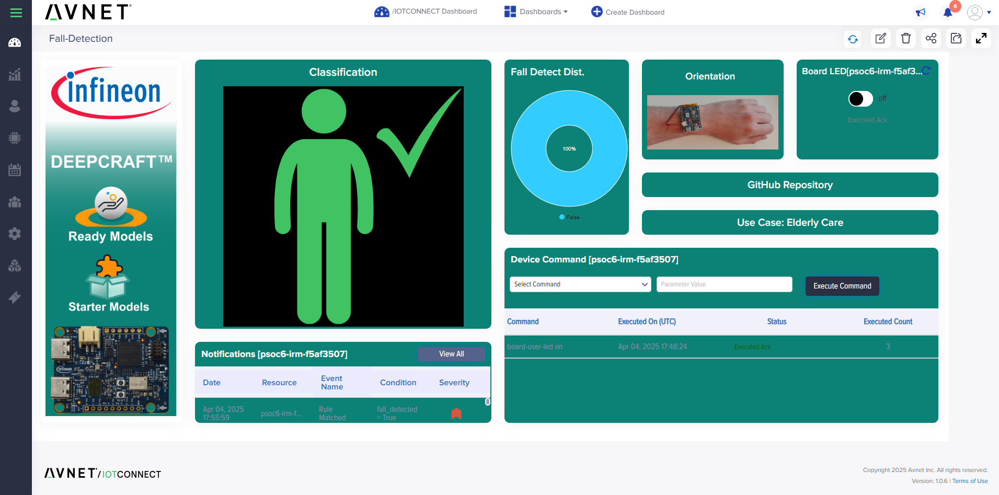

## Introduction

This repository provides an integration of Infineon's ModusToolbox™ Machine Learning (MTBML) flow with Avnet's IoTConnect platform, demonstrating a fall detection model. The application utilizes data from the on-board inertial measurement unit (IMU) to detect fall events and reports them to IoTConnect.

For instructions on modifying and using this application template to create applications, follow steps from the "My first PSoC&trade; 6 MCU design using ModusToolbox&trade;" section in [AN228571](https://www.infineon.com/an228571) – Getting started with PSoC&trade; 6 MCU on ModusToolbox&trade; software or the "My first XMC7000 MCU design using Eclipse IDE for ModusToolbox&trade;" section in [AN234334](https://www.infineon.com/dgdl/Infineon-AN234334_Getting_started_with_XMC7000_MCU_on_ModusToolbox_software-ApplicationNotes-v01_00-EN.pdf?fileId=8ac78c8c8412f8d301842d32c5765bfd) – Getting started with XMC7000 MCU on ModusToolbox&trade; software.

The project supports Eclipse and VSCode with GCC_ARM compiler.

## QuickStart Guide

To quickly evaluate this project without compiling code follow the step-by-step instructions in the [QuickStart Guide](QUICKSTART.md).

## Supported Toolchains (make variable 'TOOLCHAIN')

* GNU Arm® Embedded Compiler (GCC_ARM) - Default value of TOOLCHAIN

## Supported Boards

The code has been developed and tested with MTB 3.3, with VsCode, and the board(s) below:

### Supported kits (make variable 'TARGET')

- [PSoC&trade; 6 AI Evaluation Kit](https://www.infineon.com/CY8CKIT-062S2-AI) (`CY8CKIT-062S2-AI`)

## Building the Project

At the time of this publication, the Fall Detection Ready Model is **not** available in the default list of ModusToolbox™ example projects. To build the project:

1. Clone this repository to your local development environment.
2. Launch ModusToolbox™ and create a new project.
3. When prompted to select an application, choose **“Browse for Application”** and navigate to the location of this cloned repository.

Refer to the [DEVELOPER_LOCAL_SETUP](https://github.com/avnet-iotconnect/avnet-iotc-mtb-basic-example/blob/main/DEVELOPER_LOCAL_SETUP.md) for detailed step-by-step instructions.

> **Important Notes:**
> - After installing ModusToolbox™, ensure the **ModusToolbox™ for Machine Learning (MTBML)** extension is also installed to support AI model integration.
> - **Over-the-air (OTA) updates are currently not supported** in this application.

## Running the Demo
The DEEPCRAFT™ model is tailored to detect dangerous falls among elderly people and performs best on unpadded falls. For optimal results, it's recommended to test with a healthy adult and use pillows to avoid injury. The model is designed with very low false positives per user per week, provided the person lays still for 7-10 seconds after the fall event.

### IMU Orientation
Ensure the IMU (Inertial Measurement Unit) orientation matches the accelerometer X, Y, Z axes:

- **Bird’s eye view**: Arm flat on table
- **Y = 1, X = 0, Z = 0**: Hand held up
- **X = -1, Y = 0, Z = 0**: Hand outstretched, palm facing front
- **Z = -1, X = 1, Y = 0**: Hand outstretched, palm up
  
  

## /IOTCONNECT Device Rules
Use /IOTCONNECT rules to manage notifications and responses:

- **Rules List**: Configure rules to handle specific incidents, such as "Fall Detected" or "Device Disconnected."
- **Notification Setup**: Customize notifications via email, push notifications, webhook, or UI alerts based on triggered events.

## /IOTCONNECT Device Rules
The following commands can be sent to the device using the /IOTCONNECT Web UI:

| Command                  | Argument Type     | Description                                                                                                                                                                 |
|:-------------------------|-------------------|:----------------------------------------------------------------------------------------------------------------------------------------------------------------------------|
| `board-user-led`         | String (on/off)   | Turn the board LED on or off                                                                                                                                                |
| `set-reporting-interval` | Number (eg. 4000) | Set telemetry reporting interval in milliseconds.  By default, the application will report gestures every 1000ms and Audio every 2500ms                                     |
| `set-linger-interval`    | Number (eg. 4000) | Set linger interval in milliseconds. By default, the gestures will linger for 5 seconds and audio detection will not linger. Set to 1 if you wish to disable this behavior. |
| `demo-mode`              | String (on/off)   | Enable demo mode. In this mode the application will send telemetry to /IOTCONNECT for a longer period                                                                        |

## Other /IOTCONNECT-enabled Infineon Kits
See the list [here](https://avnet-iotconnect.github.io/#infineon-technologies)
